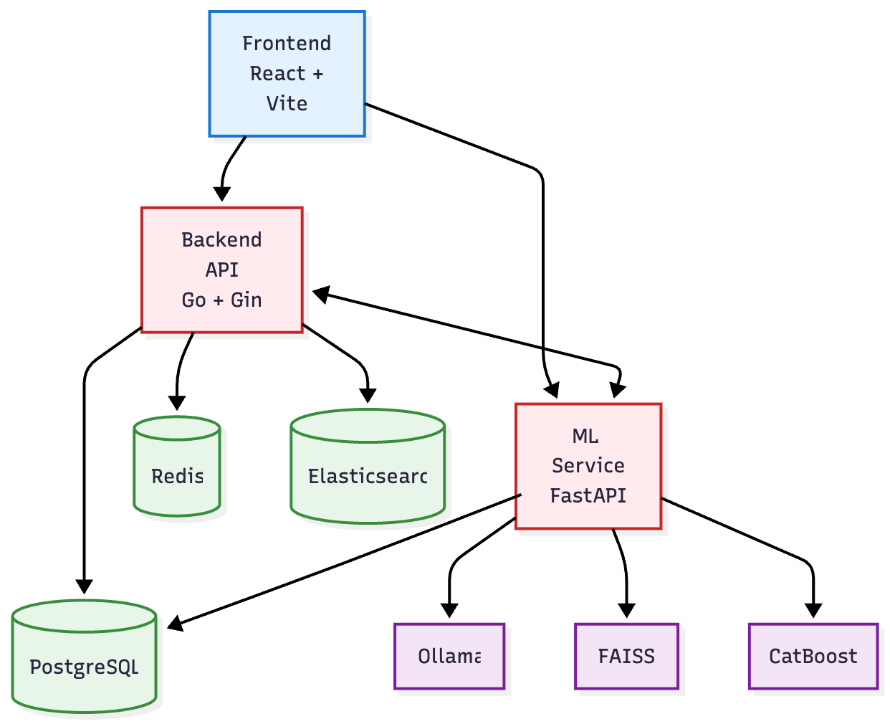
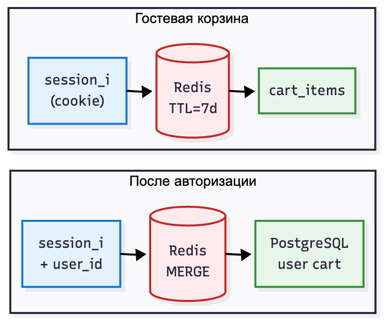
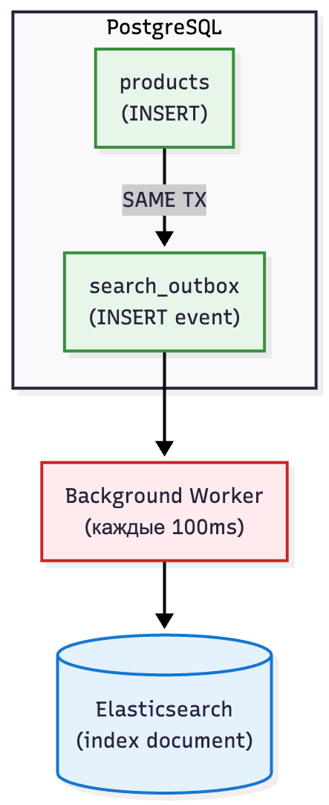
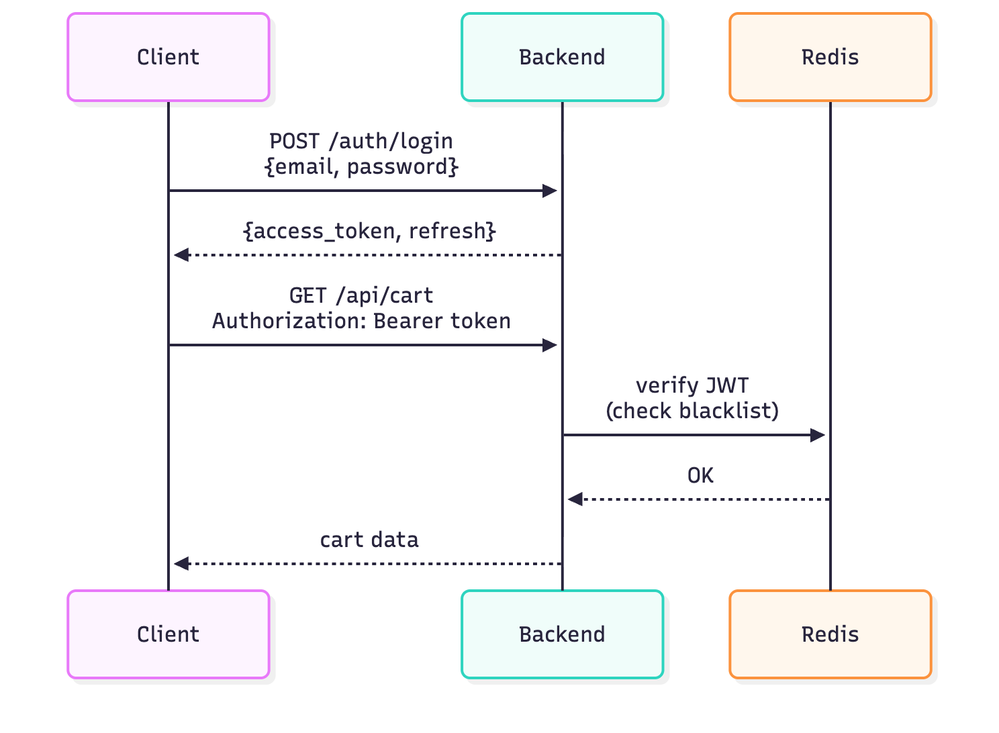
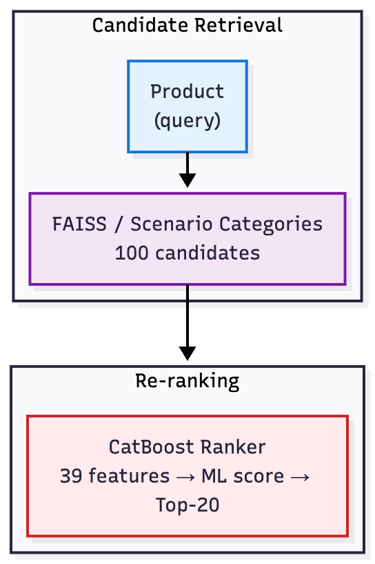
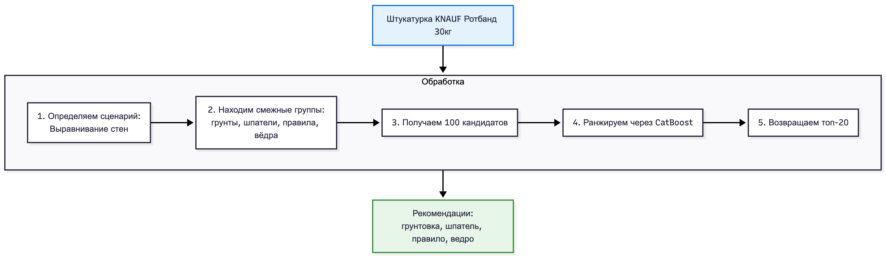
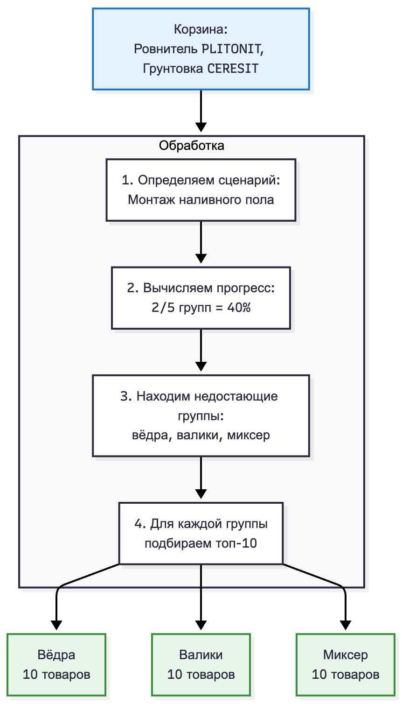

# SpbTechRun: Интеллектуальная система рекомендаций сопутствующих товаров

## О проекте

**SpbTechRun** — полнофункциональная система рекомендаций товаров для розничной сети строительных материалов МАКСИДОМ. Система решает задачу автоматического подбора сопутствующих товаров для этапа ремонта "White Box" (черновая отделка): наливные полы, выравнивание стен, монтаж перегородок.

**[Датасеты и эмбеддинги (Google Drive)](https://drive.google.com/drive/folders/1raoqlnlr_Equ8GGNeZUcAkfdRVh4iHx3?usp=sharing)**

### Бизнес-задача

При покупке строительных материалов клиенту необходимо приобрести не только основной товар (например, штукатурку), но и весь комплект сопутствующих материалов: грунтовку, шпатели, правила, ёмкости для замеса. **Проблема:** покупатель часто не знает что ещё нужно, забывает докупить, или выбирает несовместимые товары.

**Решение:** Система автоматически определяет сценарий ремонта по товарам в корзине и рекомендует недостающие товары, повышая средний чек и удобство для покупателя.

### Ключевые особенности

| Особенность | Описание | Бизнес-ценность |
|-------------|----------|-----------------|
| **Работа в закрытом контуре** | Все вычисления локальные, без внешних API | Безопасность данных, независимость от интернета |
| **Сценарный подход** | Рекомендации на основе типа ремонтных работ | Комплексные продажи вместо разовых покупок |
| **Непрерывное обучение** | Улучшение на основе фидбека без переобучения нейросети | Мгновенная адаптация к предпочтениям |
| **Двухуровневое ранжирование** | FAISS + CatBoost для точности и скорости | Время ответа < 200ms |

---

## Архитектура системы

### Обзор компонентов



### Почему микросервисная архитектура?

| Решение | Альтернатива | Почему выбрали |
|---------|--------------|----------------|
| **Два сервиса (Go + Python)** | Монолит на одном языке | Go — высокая производительность для API; Python — богатая ML-экосистема (FAISS, CatBoost, NumPy) |
| **Общая PostgreSQL** | Отдельные БД | Упрощает транзакции, нет проблем с синхронизацией данных |
| **Прокси через Go** | Прямые запросы к ML | Единая точка входа, централизованная авторизация, rate limiting |

---

## Технологические решения

### Backend (Go/Gin)

#### Почему Go?
- **Производительность**: компилируемый язык, минимальное потребление памяти
- **Простота деплоя**: один бинарник без зависимостей
- **Конкурентность**: горутины для параллельной обработки запросов
- **Типизация**: ошибки на этапе компиляции, а не в runtime

#### Redis: Кэширование и сессии

**Проблема:** Корзина должна работать быстро и сохраняться между запросами для анонимных пользователей. При этом нужно обеспечить:
- Мгновенный отклик при добавлении товаров (пользователи не ждут)
- Сохранение корзины гостя на 7 дней без регистрации
- Бесшовный переход корзины при авторизации

**Почему не PostgreSQL для сессий:** Каждый запрос требует проверки сессии — это тысячи обращений в секунду. PostgreSQL создаёт overhead на каждое соединение, Redis работает в памяти с O(1) доступом.

**Решение:** Redis как хранилище сессий и корзины с TTL.



**Merge корзины при авторизации:**
- Гость добавил 3 товара → залогинился → товары автоматически добавляются к его корзине
- Если товар уже был в корзине пользователя — количество суммируется
- Гостевая корзина очищается после merge
- Это критично для конверсии: пользователь не теряет выбранные товары

#### Elasticsearch: Полнотекстовый поиск

**Проблема:** PostgreSQL LIKE/ILIKE не подходит для поиска товаров:
- `LIKE '%штукатурка%'` не найдёт "штукатурки" или "штукатуркой" (нет морфологии)
- Full-text search в PostgreSQL не поддерживает русский язык из коробки
- При 100k+ товаров LIKE сканирует всю таблицу — это секунды вместо миллисекунд
- Нет fuzzy-поиска для исправления опечаток ("штукатурак" → ничего не найдено)

**Почему не PostgreSQL Full-Text:** Требует установки словарей, настройки конфигурации, не поддерживает fuzzy из коробки. Elasticsearch — специализированное решение с batteries included.

**Решение:** Elasticsearch с русским анализатором и fuzzy-поиском.

**Возможности:**
- **Морфология:** "штукатурка" находит "штукатурки", "штукатуркой", "штукатурку"
- **Fuzzy search:** опечатки автоматически исправляются ("штукатурак" → "штукатурка")
- **Фасетный поиск:** агрегации по категориям, брендам, ценовым диапазонам
- **Подсветка:** `<em>штукатурка</em> гипсовая` — совпадения выделяются в результатах
- **Скорость:** поиск по 100k товаров за 10-50ms

**Маппинг индекса:**
```json
{
  "properties": {
    "name": {
      "type": "text",
      "analyzer": "russian",
      "fields": {
        "keyword": { "type": "keyword" }
      }
    },
    "description": { "type": "text", "analyzer": "russian" },
    "category_path": { "type": "text", "analyzer": "russian" },
    "vendor": { "type": "keyword" },
    "price": { "type": "float" },
    "available": { "type": "boolean" }
  }
}
```

#### Outbox Pattern: Надёжная синхронизация с Elasticsearch

**Проблема:** При добавлении/обновлении товара нужно обновить и PostgreSQL, и Elasticsearch. Наивный подход:
```go
// Плохо: что если ES недоступен после коммита в БД?
db.Create(&product)
es.Index(product)  // ← Elasticsearch упал, товар не проиндексирован
```
Результат: товар есть в базе, но не находится поиском. Пользователи жалуются.

**Почему не двухфазный коммит (2PC):** Сложно, медленно, Elasticsearch не поддерживает XA-транзакции.

**Решение:** Outbox Pattern — гарантированная доставка событий через таблицу-очередь.



**Как работает:**
1. При создании/обновлении товара **в той же транзакции** пишем событие в `search_outbox`
2. Если транзакция откатилась — событие тоже откатится (атомарность)
3. Background worker каждые 100ms читает необработанные события
4. Индексирует документы в Elasticsearch
5. Помечает события как обработанные

**Преимущества:**
- **Надёжность:** если ES недоступен — события накапливаются и обработаются позже
- **Консистентность:** товар либо создан везде, либо нигде (транзакция)
- **Производительность:** основной запрос не ждёт индексацию (async)
- **Идемпотентность:** повторная обработка события безопасна

#### JWT-аутентификация

**Проблема:** Как аутентифицировать пользователей в stateless API?
- Сессии в БД — лишняя нагрузка на каждый запрос
- Сессии в Redis — зависимость от Redis для каждого запроса
- Нужен механизм отзыва токенов (logout, смена пароля)

**Решение:** JWT с двумя токенами + blacklist в Redis.



**Токены:**
- **Access token:** 15 минут, хранится в памяти клиента (не localStorage — XSS)
- **Refresh token:** 7 дней, httpOnly cookie (недоступен JS — защита от XSS)
- **Blacklist:** отозванные токены хранятся в Redis до истечения их TTL

**Почему два токена:** Access token короткоживущий — если украден, ущерб минимален. Refresh token длинный, но передаётся только при обновлении и защищён httpOnly.

---

### ML-сервис (Python/FastAPI)

#### Почему Python для ML?
- **Экосистема**: FAISS, CatBoost, NumPy, Pandas — нативная поддержка
- **FastAPI**: async из коробки, автодокументация OpenAPI
- **SQLAlchemy 2.0**: async ORM, type hints

#### Ollama: Локальные эмбеддинги

**Проблема:** Нужны семантические эмбеддинги товаров для поиска похожих, но:
- Облачные API (OpenAI, Cohere) нельзя
- Отправка 100k товаров во внешний API — дорого и медленно
- Зависимость от интернета неприемлема для production

**Почему не TF-IDF/Word2Vec:** Не понимают контекст. "Шпатель для штукатурки" и "инструмент для нанесения смеси на стену" — для них разные вещи, для нейросети — синонимы.

**Решение:** Ollama с моделью `nomic-embed-text` — полностью локальный inference.

**Процесс генерации эмбеддингов:**
```python
# Формируем текстовое представление товара
text = f"""
{product.name}
Категория: {category_path}
Производитель: {vendor}
{description[:500]}
Характеристики: {params_summary}
"""

# Ollama возвращает 768-мерный вектор
embedding = ollama.generate(text)  # [0.023, -0.156, ..., 0.089]

# Сохраняем в PostgreSQL
INSERT INTO product_embeddings (product_id, embedding) VALUES (...)
```

**Характеристики:**
- Модель: `nomic-embed-text` (274 MB)
- Размерность: 768
- Скорость: ~200 товаров/минуту на CPU
- Качество: сопоставимо с OpenAI text-embedding-ada-002

#### FAISS: Быстрый векторный поиск

**Проблема:** Поиск ближайших соседей среди 50k+ товаров по эмбеддингам:
- Наивный подход: вычислить косинусное сходство со всеми 100k векторами = O(n)
- При 768 измерениях это ~77M операций на каждый запрос
- Даже на быстром CPU это 100-500ms — слишком медленно для real-time

**Почему не PostgreSQL pgvector:** Хороший вариант, но FAISS быстрее для in-memory поиска. pgvector лучше когда нужна персистентность и SQL-запросы.

**Решение:** FAISS (Facebook AI Similarity Search) — специализированная библиотека для ANN (Approximate Nearest Neighbors).

```python
# При старте сервиса загружаем эмбеддинги в индекс
index = faiss.IndexFlatIP(768)  # Inner Product (для нормализованных = cosine)
index.add(embeddings_matrix)    # 100k векторов

# Поиск топ-100 похожих за ~1ms
distances, indices = index.search(query_embedding, k=100)
```

**Почему IndexFlatIP:**
- Точный поиск (не приближённый)
- Для 100k товаров достаточно быстро (~1ms)
- При росте до 1M+ можно переключиться на IVF-индекс

#### CatBoost: ML-ранжирование

**Проблема:** Простой скоринг по формуле не работает для рекомендаций:
```python
# Наивный подход — ручные веса
score = 0.5 * similarity + 0.3 * same_category + 0.2 * popularity
```
- Веса подобраны "на глаз" — не оптимальны
- Не учитывает нелинейные зависимости (например: скидка важна только для дорогих товаров)
- Не адаптируется к данным — нужно вручную перенастраивать

**Почему не нейросеть:** Для 39 табличных признаков градиентный бустинг работает лучше. Нейросети хороши для изображений/текста, но для structured data CatBoost/XGBoost — SOTA.

**Решение:** CatBoost Ranker — градиентный бустинг для learning-to-rank, автоматически находит оптимальные веса и нелинейные зависимости.

**Двухуровневая архитектура:**



**39 признаков в 7 группах:**

| Группа | Признаки | Описание |
|--------|----------|----------|
| **Семантические (6)** | cosine_similarity, l2_distance, dot_product, euclidean, manhattan, has_embedding | Близость эмбеддингов |
| **Фидбек (8)** | pair_positive, pair_negative, pair_approval, scenario_positive, scenario_negative, scenario_approval, pair_total, scenario_total | Статистика оценок |
| **Ценовые (7)** | price, price_ratio, price_diff, price_diff_percent, has_discount, discount_percent, discount_amount | Ценовые характеристики |
| **Категорийные (5)** | same_category, same_root, category_distance, same_vendor, different_vendor | Иерархия категорий |
| **Co-purchase (3)** | copurchase_count, copurchase_log, copurchase_exists | Совместные покупки |
| **Популярность (7)** | has_image, is_discounted, price_bucket, name_length, view_count, cart_add_count, order_count | Метрики товара |
| **Контекст корзины (3)** | cart_similarity_max, cart_similarity_avg, cart_products_count | Связь с корзиной |

**Обучение:**
```python
model = CatBoostRanker(
    iterations=500,
    learning_rate=0.05,
    depth=6,
    loss_function="YetiRank",  # Pairwise ranking loss
    eval_metric="NDCG:top=10",
)

# Данные группируются по main_product_id (query)
model.fit(X_train, y_train, group_id=groups)
```

**Источники обучающих данных:**
- Позитивные: фидбек (👍 ≥ 5) + совместные покупки (copurchase ≥ 2)
- Негативные: фидбек (👎 > 👍) + hard negatives (случайные товары)

---

### Frontend (React + TypeScript)

#### Почему этот стек?

| Технология | Почему выбрали |
|------------|----------------|
| **React 19** | Компонентный подход, огромная экосистема, Server Components |
| **TypeScript** | Типобезопасность, автодополнение, рефакторинг без страха |
| **Vite** | Мгновенный HMR, быстрая сборка (в 10-100x быстрее Webpack) |
| **TanStack Query** | Кэширование запросов, дедупликация, оптимистичные обновления |
| **Zustand** | Простой state-менеджмент без boilerplate Redux |
| **Tailwind CSS** | Utility-first, нет конфликтов CSS, tree-shaking |

#### TanStack Query: Управление серверным состоянием

**Проблема:** Управление данными с сервера в React — боль:
- Дублирование запросов: 3 компонента запрашивают одни данные = 3 запроса
- Кэширование: когда инвалидировать? Как синхронизировать между вкладками?
- Loading/Error состояния: в каждом компоненте писать `if (loading) return <Spinner />`
- Race conditions: быстро переключаем страницы — старый запрос возвращается после нового

**Почему не Redux/Zustand для серверных данных:** Это инструменты для клиентского состояния. Для серверного нужен специализированный подход с кэшированием, инвалидацией, retry.

**Решение:** TanStack Query (React Query) — библиотека для server state management.

```typescript
// Рекомендации кэшируются по product_id
export function useRecommendations(productId: number) {
  return useQuery({
    queryKey: ['recommendations', productId],
    queryFn: () => getRecommendations(productId),
    staleTime: 5 * 60 * 1000,  // 5 минут считаются свежими
  })
}

// Сценарии кэшируются по корзине, но показывают старые данные при обновлении
export function useScenarioRecommendations(scenarioId: string, cartIds: number[]) {
  return useQuery({
    queryKey: ['scenarioRecommendations', scenarioId, cartIds],
    queryFn: () => getScenarioRecommendations(scenarioId, cartIds),
    placeholderData: (prev) => prev,  // Нет моргания при обновлении
  })
}
```

**`placeholderData` для плавного UX:**
- При добавлении товара в корзину рекомендации перезапрашиваются
- Без `placeholderData`: экран моргает (loading → data)
- С `placeholderData`: старые данные показываются пока грузятся новые

#### Zustand: Глобальное состояние

```typescript
// Простой store для корзины
export const useCartStore = create<CartStore>((set, get) => ({
  items: [],

  addItem: async (productId, quantity) => {
    set((state) => ({
      loadingProducts: [...state.loadingProducts, productId]
    }))

    await api.addToCart(productId, quantity)

    set((state) => ({
      items: [...state.items, { productId, quantity }],
      loadingProducts: state.loadingProducts.filter(id => id !== productId)
    }))
  },

  isProductLoading: (productId) =>
    get().loadingProducts.includes(productId),
}))
```

---

## ML-система рекомендаций

### Два типа рекомендаций

#### Тип 1: На странице товара



#### Тип 2: По сценарию (карусель на главной)



### Сценарии ремонта (White Box)

Три предопределённых сценария с явно заданными категориями товаров:

#### 1. Монтаж наливного пола

| Группа | ID категорий | Обязательно |
|--------|--------------|-------------|
| Смеси для выравнивания полов | 25185, 30465, 30466 | Да |
| Грунтовки и гидроизоляция | 25380, 25379, 31147, 25186 | Да |
| Ёмкости | 30072, 27175, 30814 | Да |
| Валики игольчатые | 30806-30811 | Да |
| Миксеры строительные | 29165, 30654, 23622, 33927 | Да |
| Уровни | 23708, 29926 | Нет |
| Плёнка защитная | 25500, 27182, 30227 | Нет |

#### 2. Монтаж перегородок

| Группа | ID категорий | Обязательно |
|--------|--------------|-------------|
| Газобетонные блоки и гипсокартон | 25229, 25165, 25166 | Да |
| Клей монтажный | 25201 | Да |
| Грунтовки | 25380, 25379, 31147 | Да |
| Шпатлёвки | 25179, 30459-30462 | Да |
| Ёмкости | 30072, 27175, 30814 | Да |
| Миксеры строительные | 29165, 30654, 23622, 33927 | Да |

#### 3. Выравнивание стен

| Группа | ID категорий | Обязательно |
|--------|--------------|-------------|
| Штукатурка | 25178, 30458 | Да |
| Грунтовки | 25380, 25379, 31147 | Да |
| Шпатлёвки | 25179, 30459-30462 | Да |
| Ёмкости | 30072, 27175, 30814 | Да |
| Правила | 23705 | Да |
| Шпатели | 30226 | Да |
| Миксеры строительные | 29165, 30654, 23622, 33927 | Да |
| Сетки и серпянка | 27813, 30229, 30230 | Нет |

### Система фидбека

#### Байесовское сглаживание

**Проблема:** Наивный расчёт рейтинга рекомендаций не работает:
- Товар с 1 лайком и 0 дизлайков = 100% approval
- Товар с 100 лайками и 10 дизлайками = 91% approval
- Первый товар "лучше"? Нет, у него просто мало данных!

Это классическая проблема cold start — новые товары с одним лайком вытесняют проверенные.

**Решение:** Формула Лапласа (Bayesian smoothing) — добавляем "виртуальные" голоса:

```
approval_rate = (positive + 1) / (total + 2)
```

| Лайки | Дизлайки | Наивный % | Байесовский % |
|-------|----------|-----------|---------------|
| 1 | 0 | 100% | 67% |
| 0 | 1 | 0% | 33% |
| 10 | 0 | 100% | 92% |
| 5 | 5 | 50% | 50% |
| 0 | 0 | N/A | 50% |

#### Типы фидбека

1. **Pair feedback** — оценка конкретной пары "основной товар → рекомендация"
2. **Scenario feedback** — оценка товара в контексте сценария

```sql
-- Сырой фидбек (для аналитики)
product_pair_feedback (main_product_id, recommended_product_id, feedback_type, user_id)

-- Агрегированный (для ранжирования)
pair_feedback_stats (main_product_id, recommended_product_id, positive_count, negative_count)
```

### Эволюция качества


---

## Структура базы данных

### E-commerce таблицы

```sql
-- Иерархия категорий (дерево через parent_id)
categories (id, name, parent_id)

-- Каталог товаров (~100k записей)
products (id, name, description, price, category_id, vendor, params JSONB, picture, available)

-- Акционные цены с датами
promos (id, product_id, discount_price, start_date, end_date)

-- Пользователи с bcrypt-хэшами
users (id, email, password_hash, created_at)

-- Корзина (user_id XOR session_id)
cart_items (id, user_id, session_id, product_id, quantity)

-- Заказы
orders (id, user_id, status, total, created_at)
order_items (id, order_id, product_id, quantity, price)
```

### ML-таблицы

```sql
-- Эмбеддинги (768-мерные float[])
product_embeddings (product_id, embedding, text_representation, created_at)

-- Статистика просмотров/корзины/заказов
product_stats (product_id, view_count, cart_add_count, order_count, updated_at)

-- Фидбек
product_pair_feedback (main_product_id, recommended_product_id, feedback_type, user_id)
pair_feedback_stats (main_product_id, recommended_product_id, positive_count, negative_count)

scenario_feedback (scenario_id, group_name, product_id, feedback_type, user_id)
scenario_feedback_stats (scenario_id, group_name, product_id, positive_count, negative_count)

-- Co-purchase из заказов
copurchase_stats (product_id_1, product_id_2, copurchase_count)
```

### Outbox для Elasticsearch

```sql
-- Очередь событий для индексации
search_outbox (id, entity_type, entity_id, operation, payload JSONB, processed, created_at)
```

---

## API

### Backend (Go) — порт 8080

| Метод | Эндпоинт | Описание |
|-------|----------|----------|
| GET | `/api/products` | Список товаров с пагинацией |
| GET | `/api/products/:id` | Детали товара |
| POST | `/api/products/:id/view` | Трекинг просмотра |
| GET | `/api/categories` | Дерево категорий |
| GET | `/api/search?q=...` | Полнотекстовый поиск |
| POST | `/api/auth/register` | Регистрация |
| POST | `/api/auth/login` | Авторизация (JWT) |
| GET | `/api/cart` | Корзина |
| POST | `/api/cart/items` | Добавить товар |
| DELETE | `/api/cart/items/:id` | Удалить товар |
| POST | `/api/orders` | Создать заказ |
| GET | `/api/recommendations/:id` | Рекомендации (прокси к ML) |
| GET | `/api/scenarios` | Сценарии (прокси к ML) |

### ML-сервис (Python) — порт 8000

| Метод | Эндпоинт | Описание |
|-------|----------|----------|
| GET | `/recommendations/{product_id}` | 20 сопутствующих товаров |
| GET | `/recommendations/{id}/with-ml` | С явным контролем ML |
| GET | `/scenarios` | Список сценариев |
| GET | `/scenarios/{id}/recommendations` | Рекомендации для сценария |
| GET | `/recommendations/scenario/auto` | Авто-определение сценария |
| POST | `/feedback` | Отправить оценку |
| POST | `/events` | Логирование событий |
| POST | `/ml/train` | Обучить CatBoost |
| GET | `/ml/model-info` | Статус модели |

---

## Запуск проекта

### Требования

- Docker и Docker Compose
- 8+ GB RAM
- Ollama (только для генерации эмбеддингов)

### Быстрый старт (с готовыми эмбеддингами)

```bash
# 1. Запуск всех сервисов
docker-compose up -d

# 2. Загрузка данных и эмбеддингов
cd data && pip install -r requirements.txt && python load_data.py

# 3. Импорт эмбеддингов (скачать с Google Drive)
python import_embeddings.py

# 4. Перезапуск ML-сервиса для загрузки эмбеддингов в FAISS
docker-compose restart recommendations

# 5. Обучение CatBoost (опционально, улучшает качество)
curl -X POST "http://localhost:8000/ml/train?iterations=500"
```

### Полный запуск (генерация эмбеддингов с нуля)

```bash
# 1. Установка Ollama (Mac)
brew install ollama && ollama serve  # в отдельном терминале
ollama pull nomic-embed-text

# 2. Запуск сервисов
docker-compose up -d

# 3. Загрузка данных
cd data && pip install -r requirements.txt && python load_data.py

# 4. Генерация эмбеддингов (~10-30 минут)
docker exec -it spbtechrun-recommendations-1 python -m app.generate_embeddings

# 5. Генерация синтетического фидбека для холодного старта
docker exec spbtechrun-recommendations-1 python -m app.generate_synthetic_feedback

# 6. Обучение CatBoost
curl -X POST "http://localhost:8000/ml/train?iterations=500"

# 7. Перезапуск ML-сервиса
docker-compose restart recommendations
```

### Переобучение CatBoost

CatBoost рекомендуется переобучать по мере накопления фидбека и заказов:

```bash
# Переобучение модели (занимает ~1-2 минуты)
curl -X POST "http://localhost:8000/ml/train?iterations=500"

# Проверка статуса модели
curl "http://localhost:8000/ml/model-info"
```

**Когда переобучать:**
- После накопления 100+ новых оценок фидбека
- После значительного роста заказов (co-purchase данные)
- Раз в неделю при активном использовании

### Доступ к сервисам

| Сервис | URL |
|--------|-----|
| Frontend | http://localhost:3000 |
| Backend API | http://localhost:8080/api |
| ML API | http://localhost:8000 |
| Elasticsearch | http://localhost:9200 |

---

## Метрики качества

### ML-модель

| Метрика | Значение | Описание |
|---------|----------|----------|
| NDCG@10 | 0.70+ | Качество ранжирования топ-10 |
| AUC | 0.86+ | Способность отличать позитивные от негативных |
| Inference | < 50ms | Время ранжирования 100 кандидатов |

### Производительность системы

| Операция | Время | Примечание |
|----------|-------|------------|
| Поиск товаров | < 50ms | Elasticsearch |
| Рекомендации | < 200ms | FAISS + CatBoost |
| Добавление в корзину | < 100ms | Redis |
| Загрузка страницы | < 1s | С кэшированием |

---

## Структура проекта

```
SpbTechRun/
├── backend/                      # Go API сервис
│   ├── cmd/server/               # Точка входа
│   ├── internal/
│   │   ├── handler/              # HTTP-обработчики
│   │   ├── service/              # Бизнес-логика
│   │   ├── repository/           # Работа с БД
│   │   ├── cache/                # Redis-кэш
│   │   └── search/               # Elasticsearch
│   └── migrations/               # SQL-миграции
│
├── recommendations/              # Python ML-сервис
│   └── app/
│       ├── api/                  # FastAPI роуты
│       ├── services/             # Логика рекомендаций
│       ├── ml/                   # CatBoost, Feature Extractor
│       ├── core/                 # Эмбеддинги, конфиг
│       └── db/                   # SQLAlchemy
│
├── frontend/                     # React приложение
│   └── src/
│       ├── pages/                # Страницы
│       ├── components/           # UI-компоненты
│       ├── api/                  # API-клиенты
│       ├── hooks/                # React Query hooks
│       └── store/                # Zustand stores
│
├── data/                         # Скрипты загрузки данных
│   ├── load_data.py
│   ├── export_embeddings.py
│   └── import_embeddings.py
│
└── docker-compose.yml            # Оркестрация
```
