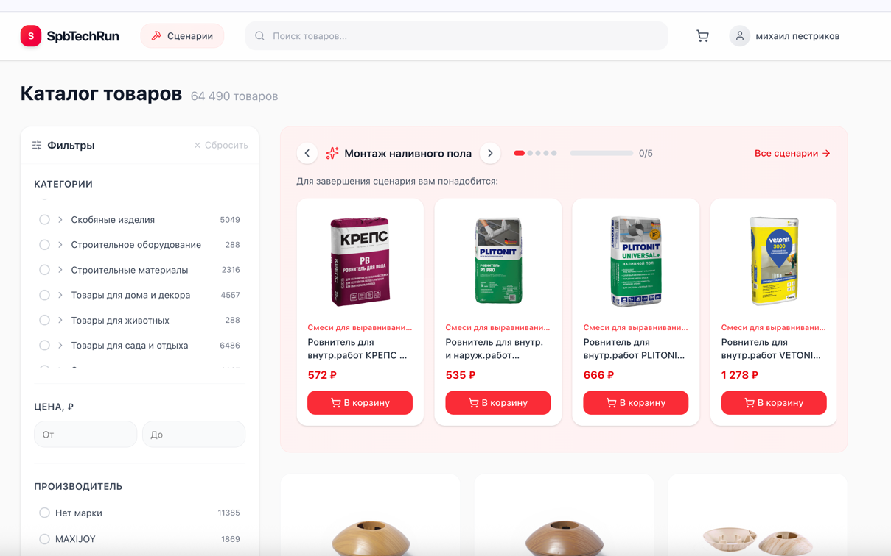
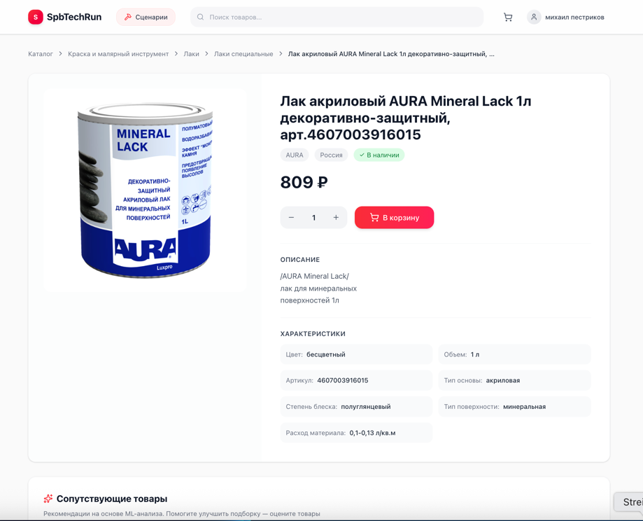
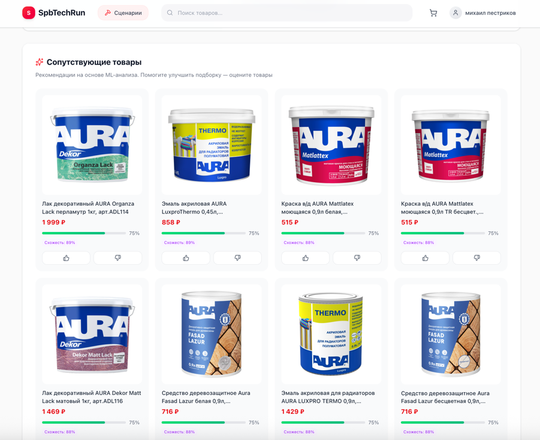
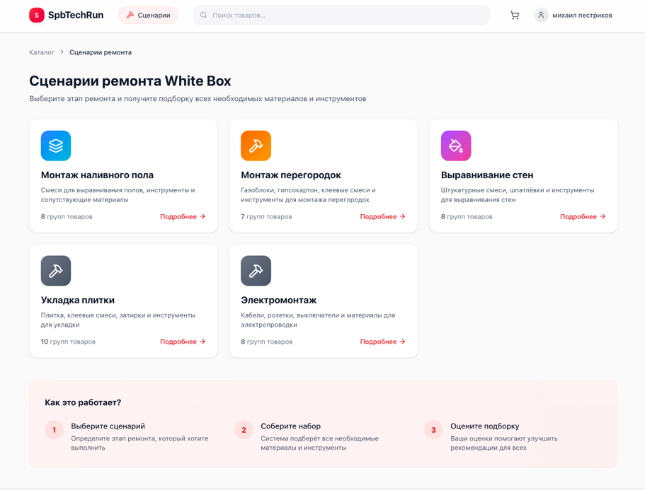
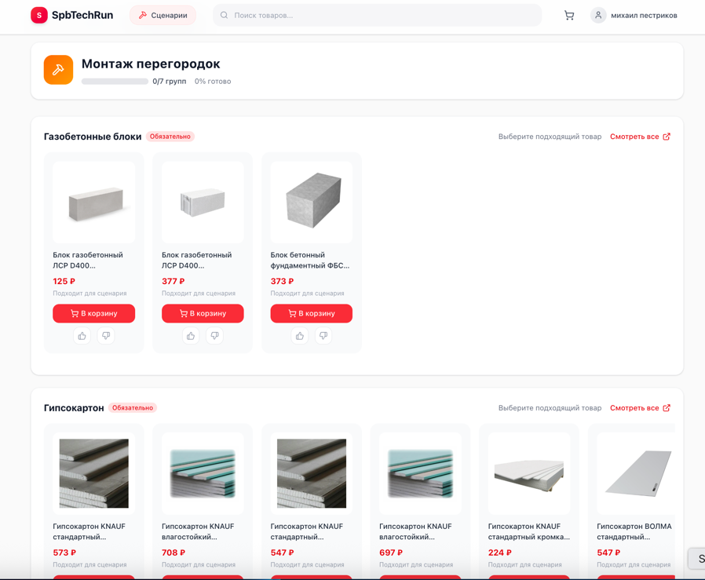
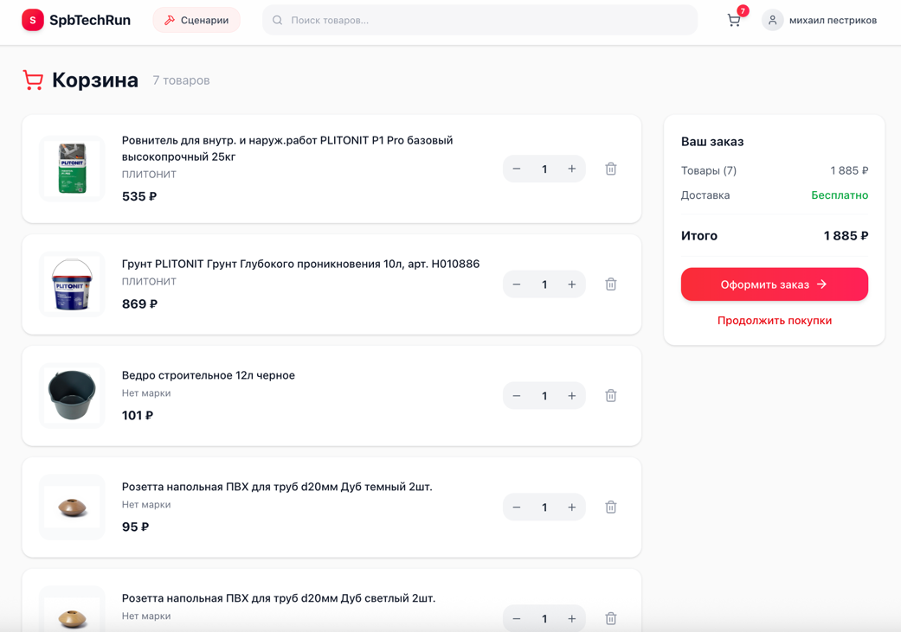

# Frontend (React + TypeScript + Vite)

SPA-интерфейс интернет-магазина строительных материалов с системой рекомендаций.

## Технологии

| Технология | Версия | Назначение |
|------------|--------|------------|
| React | 19.2 | UI-библиотека |
| TypeScript | 5.9 | Типизация |
| Vite | 7.2 | Сборка и dev-сервер |
| TanStack Query | 5.90 | Server state management |
| Zustand | 5.0 | Client state management |
| React Router | 7.9 | Маршрутизация |
| Tailwind CSS | 4.1 | Стилизация |
| Axios | 1.13 | HTTP-клиент |
| Lucide React | 0.555 | Иконки |
| DOMPurify | 3.3 | XSS-защита HTML |

## Структура проекта

```
src/
├── api/                        # API-клиенты
│   ├── client.ts               # Axios instance с interceptors
│   ├── products.ts             # Товары и категории
│   ├── search.ts               # Elasticsearch поиск
│   ├── cart.ts                 # Корзина
│   ├── auth.ts                 # Авторизация
│   ├── orders.ts               # Заказы
│   ├── recommendations.ts      # ML-рекомендации
│   └── scenarios.ts            # Сценарии ремонта
│
├── pages/
│   ├── HomePage.tsx            # Каталог + карусель сценариев
│   ├── ProductPage.tsx         # Карточка товара + рекомендации
│   ├── CartPage.tsx            # Корзина + оформление
│   ├── ScenariosPage.tsx       # Список сценариев
│   ├── ScenarioDetailPage.tsx  # Детали сценария с прогрессом
│   ├── LoginPage.tsx           # Авторизация
│   ├── RegisterPage.tsx        # Регистрация
│   ├── ProfilePage.tsx         # Профиль
│   └── OrderHistoryPage.tsx    # История заказов
│
├── components/
│   ├── ui/                     # Базовые компоненты (shadcn/ui стиль)
│   │   ├── button.tsx
│   │   ├── card.tsx
│   │   ├── input.tsx
│   │   └── badge.tsx
│   ├── layout/
│   │   ├── Header.tsx          # Шапка с поиском и корзиной
│   │   ├── SearchBar.tsx       # Поиск с автокомплитом
│   │   └── PageLayout.tsx      # Обёртка страниц
│   ├── product/
│   │   ├── ProductCard.tsx     # Карточка в каталоге
│   │   └── ProductGrid.tsx     # Сетка товаров
│   ├── cart/
│   │   └── AddToCartButton.tsx # Кнопка добавления
│   ├── filters/
│   │   └── CategoryTree.tsx    # Дерево категорий
│   └── recommendations/
│       └── ScenarioCarousel.tsx # Карусель сценариев
│
├── hooks/                      # React Query хуки
│   ├── useProducts.ts          # useProducts, useProduct, useCategories, useSearch
│   ├── useRecommendations.ts   # useRecommendations, useFeedback
│   ├── useScenarios.ts         # useScenarios, useScenarioRecommendations
│   └── useOrders.ts            # useOrders, useCreateOrder
│
├── store/                      # Zustand stores
│   ├── cartStore.ts            # Корзина
│   └── authStore.ts            # Авторизация
│
├── types/index.ts              # TypeScript типы
├── lib/utils.ts                # Утилиты (cn, capitalize, formatPrice)
├── App.tsx                     # Роутинг
└── main.tsx                    # Entry point
```

## Ключевые компоненты

### HomePage — Главная страница

```typescript
function HomePage() {
  const [filters, setFilters] = useState<SearchFilter>({})
  const { data, isLoading, fetchNextPage } = useSearch(filters)
  const { items: cartItems } = useCartStore()

  // Карусель сценариев показывается только когда есть товары в корзине
  const cartProductIds = cartItems.map(item => item.product_id)

  return (
    <PageLayout>
      <ScenarioCarousel cartProductIds={cartProductIds} />

      <div className="flex gap-6">
        <FilterSidebar filters={filters} onChange={setFilters} />
        <ProductGrid
          products={data?.pages.flatMap(p => p.products)}
          onLoadMore={fetchNextPage}
        />
      </div>
    </PageLayout>
  )
}
```

### ProductPage — Карточка товара

```typescript
function ProductPage() {
  const { id } = useParams()
  const { data: product } = useProduct(Number(id))
  const { data: recommendations } = useRecommendations(Number(id))
  const { mutate: sendFeedback } = useFeedback()

  return (
    <PageLayout>
      <ProductDetails product={product} />

      <RecommendationsSection
        recommendations={recommendations}
        onFeedback={(productId, type) =>
          sendFeedback({
            main_product_id: Number(id),
            recommended_product_id: productId,
            feedback: type,
            context: 'product_page'
          })
        }
      />
    </PageLayout>
  )
}
```

### ScenarioCarousel — Карусель сценариев

```typescript
function ScenarioCarousel({ cartProductIds }: { cartProductIds: number[] }) {
  const { data: scenarios } = useScenarios()
  const [currentIndex, setCurrentIndex] = useState(0)

  const currentScenarioId = scenarios?.[currentIndex]?.id
  const { data } = useScenarioRecommendations(currentScenarioId, cartProductIds)

  // Стрелки для циклического переключения
  const next = () => setCurrentIndex((i) => (i + 1) % scenarios.length)
  const prev = () => setCurrentIndex((i) => (i - 1 + scenarios.length) % scenarios.length)

  return (
    <div className="bg-gradient-to-r from-red-50 to-rose-50 rounded-2xl p-6">
      <div className="flex items-center gap-3">
        <button onClick={prev}><ChevronLeft /></button>
        <h2>{data?.scenario.name}</h2>
        <button onClick={next}><ChevronRight /></button>

        {/* Прогресс-бар */}
        <ProgressBar value={data?.progress.percentage} />
      </div>

      {/* Горизонтальный скролл товаров */}
      <div className="flex gap-4 overflow-x-auto">
        {data?.recommendations.flatMap(group =>
          group.products.map(product => (
            <ProductCard key={product.id} product={product} />
          ))
        )}
      </div>
    </div>
  )
}
```

## React Query — Server State

### Конфигурация

```typescript
// App.tsx
const queryClient = new QueryClient({
  defaultOptions: {
    queries: {
      staleTime: 5 * 60 * 1000,  // 5 минут данные считаются свежими
      retry: 1,                   // 1 повторная попытка при ошибке
    },
  },
})
```

### Хуки

```typescript
// hooks/useProducts.ts
export function useProduct(id: number) {
  return useQuery({
    queryKey: ['product', id],
    queryFn: () => api.getProduct(id),
    enabled: id > 0,
  })
}

export function useSearch(filters: SearchFilter) {
  return useInfiniteQuery({
    queryKey: ['search', filters],
    queryFn: ({ pageParam = 0 }) =>
      api.search({ ...filters, offset: pageParam }),
    getNextPageParam: (lastPage) =>
      lastPage.offset + lastPage.limit < lastPage.total
        ? lastPage.offset + lastPage.limit
        : undefined,
  })
}

// hooks/useScenarios.ts
export function useScenarioRecommendations(scenarioId: string, cartIds: number[]) {
  return useQuery({
    queryKey: ['scenarioRecommendations', scenarioId, cartIds],
    queryFn: () => api.getScenarioRecommendations(scenarioId, cartIds),
    enabled: !!scenarioId,
    placeholderData: (prev) => prev,  // Предотвращает моргание при обновлении
  })
}
```

### placeholderData для плавного UX

**Проблема:** При добавлении товара в корзину рекомендации перезапрашиваются (новый queryKey). Без placeholderData:

```
Пользователь добавляет товар
  → queryKey меняется (новый cart)
  → isLoading = true
  → UI показывает скелетон
  → Данные загрузились
  → UI показывает новые рекомендации

Результат: экран "моргает"
```

**Решение:** `placeholderData: (prev) => prev` — пока новые данные грузятся, показываем старые:

```
Пользователь добавляет товар
  → queryKey меняется
  → placeholderData = предыдущие данные
  → UI показывает предыдущие данные (без моргания)
  → Новые данные загрузились
  → UI плавно обновляется
```

## Zustand — Client State

### cartStore

```typescript
// store/cartStore.ts
interface CartState {
  items: CartItem[]
  loadingProductId: number | null

  fetchCart: () => Promise<void>
  addItem: (productId: number, quantity?: number) => Promise<void>
  updateQuantity: (itemId: number, quantity: number) => Promise<void>
  removeItem: (itemId: number) => Promise<void>
  clear: () => Promise<void>

  totalItems: () => number
  isProductLoading: (productId: number) => boolean
}

export const useCartStore = create<CartState>()((set, get) => ({
  items: [],
  loadingProductId: null,

  addItem: async (productId, quantity = 1) => {
    // Показываем спиннер только на этой кнопке
    set({ loadingProductId: productId })
    try {
      await api.addToCart(productId, quantity)
      await get().fetchCart()
    } finally {
      set({ loadingProductId: null })
    }
  },

  isProductLoading: (productId) => get().loadingProductId === productId,

  totalItems: () => get().items.reduce((sum, item) => sum + item.quantity, 0),
}))
```

### Использование вне React

```typescript
// Можно использовать в API interceptors
import { useCartStore } from '@/store/cartStore'

// Прямой доступ к состоянию
const items = useCartStore.getState().items

// Подписка на изменения
useCartStore.subscribe((state) => {
  console.log('Cart updated:', state.items.length)
})
```

## API Client

```typescript
// api/client.ts
const client = axios.create({
  baseURL: '/api',
  withCredentials: true,
})

// Request interceptor — добавляем токен и session_id
client.interceptors.request.use((config) => {
  const token = useAuthStore.getState().token
  if (token) {
    config.headers.Authorization = `Bearer ${token}`
  }

  // Session ID для корзины гостей
  let sessionId = localStorage.getItem('session_id')
  if (!sessionId) {
    sessionId = crypto.randomUUID()
    localStorage.setItem('session_id', sessionId)
  }
  config.headers['X-Session-ID'] = sessionId

  return config
})

// Response interceptor — обработка 401
client.interceptors.response.use(
  (response) => response,
  async (error) => {
    if (error.response?.status === 401) {
      // Пробуем обновить токен
      const refreshed = await tryRefreshToken()
      if (refreshed) {
        return client(error.config)
      }
      // Редирект на логин
      useAuthStore.getState().logout()
      window.location.href = '/login'
    }
    throw error
  }
)
```

## Типы данных

```typescript
// types/index.ts
interface Product {
  id: number
  name: string
  price: number
  discount_price?: number
  picture?: string
  vendor?: string
  description?: string
  params?: Record<string, string>
  available: boolean
  category_id: number
}

interface Recommendation {
  product: Product
  score: number
  reason: string
  match_reasons?: MatchReason[]
}

interface ScenarioRecommendationsResponse {
  scenario: { id: string; name: string }
  progress: { completed: number; total: number; percentage: number }
  recommendations: GroupRecommendation[]
  completed_groups: CompletedGroup[]
}

interface SearchResponse {
  products: Product[]
  total: number
  aggregations: {
    categories: CategoryAgg[]
    vendors: VendorAgg[]
    price_range?: { min: number; max: number }
  }
}
```

## Запуск

### Development

```bash
npm install
npm run dev
# Откроется http://localhost:5173
```

### Production

```bash
npm run build
npm run preview
```

### Docker

```bash
docker compose up frontend
# Откроется http://localhost:3000
```

## Конфигурация

### Vite Proxy (development)

```typescript
// vite.config.ts
export default defineConfig({
  server: {
    proxy: {
      '/api': 'http://localhost:8080',
      '/recommendations': 'http://localhost:8000',
    }
  }
})
```

### Nginx (production)

```nginx
# frontend/nginx.conf
server {
    listen 80;

    location / {
        root /usr/share/nginx/html;
        try_files $uri $uri/ /index.html;
    }

    location /api/ {
        proxy_pass http://backend:8080/api/;
    }

    location /recommendations/ {
        proxy_pass http://recommendations:8000/;
    }
}
```

## Скрипты

| Команда | Описание |
|---------|----------|
| `npm run dev` | Dev-сервер с HMR |
| `npm run build` | Production сборка |
| `npm run preview` | Локальный preview production |
| `npm run lint` | ESLint проверка |

## Скриншоты

### Главная страница

Каталог товаров с фильтрами. Карусель сценариев с рекомендациями.



### Карточка товара

Детали товара, характеристики, кнопка добавления.



### ML-рекомендации

Блок "Сопутствующие товары" с кнопками фидбека.



### Сценарии ремонта

Список сценариев White Box с инструкцией.



### Детали сценария

Группы товаров с прогресс-баром.



### Корзина

Список товаров, итого, оформление заказа.


